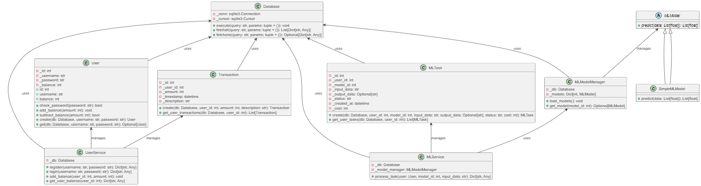

# Личный кабинет пользователя ML сервиса

## Описание задачи
Создание веб-приложения "Личный кабинет пользователя ML сервиса". Приложение позволяет пользователям регистрироваться, авторизовываться, пополнять баланс, выполнять запросы к ML сервису, просматривать историю транзакций и загруженных данных, а также взаимодействовать с ML сервисом через REST интерфейс.

## Функциональные требования
- Главная страница с описанием возможностей ML сервиса.
- Возможность зарегистрироваться и авторизоваться.
- Возможность просматривать баланс (баланс в условных кредитах).
- Возможность пополнять баланс через кнопку "Пополнить" (эквайринг подключать не требуется).
- Возможность выполнить запрос к ML сервису из Web интерфейса со списанием кредитов с баланса (при условии успешного выполнения запроса).
- Возможность просматривать историю загруженных данных и предсказаний по ним, с указанием суммы списанных кредитов.
- Возможность выполнять запросы к ML сервису с помощью REST интерфейса.
- Предусмотрена валидация данных. Если в загружаемой выборке присутствуют ошибочные данные, то они возвращаются пользователю, а над валидными данными производятся предсказания.
- Предусмотрена проверка на положительный баланс при запросах к системе.

## Описание классов и их взаимосвязь

### Database
Класс для управления операциями с базой данных.
- `execute(query: str, params: tuple = ()) -> None`: Выполняет SQL-запрос.
- `fetchall(query: str, params: tuple = ()) -> List[Dict[str, Any]]`: Получает все результаты для данного запроса.
- `fetchone(query: str, params: tuple = ()) -> Optional[Dict[str, Any]]`: Получает один результат для данного запроса.

### MLModel (абстрактный класс)
Базовый абстрактный класс для всех моделей машинного обучения.
- `predict(data: List[float]) -> List[float]`: Абстрактный метод для выполнения предсказаний.

### SimpleMLModel
Конкретная реализация ML модели.
- `predict(data: List[float]) -> List[float]`: Выполняет предсказания, умножая каждый входной элемент на 2.

### User
Класс для представления пользователя.
- `id`: Идентификатор пользователя.
- `username`: Имя пользователя.
- `balance`: Баланс пользователя.
- `check_password(password: str) -> bool`: Проверяет пароль пользователя.
- `add_balance(amount: int) -> None`: Добавляет сумму к балансу пользователя.
- `subtract_balance(amount: int) -> bool`: Вычитает сумму с баланса пользователя, если достаточно средств.
- `create(db: Database, username: str, password: str) -> 'User'`: Создает нового пользователя в базе данных.
- `get(db: Database, username: str, password: str) -> Optional['User']`: Получает пользователя из базы данных по имени и паролю.

### Transaction
Класс для представления транзакции.
- `id`: Идентификатор транзакции.
- `user_id`: Идентификатор пользователя.
- `amount`: Сумма транзакции.
- `timestamp`: Временная метка транзакции.
- `description`: Описание транзакции.
- `create(db: Database, user_id: int, amount: int, description: str) -> 'Transaction'`: Создает новую транзакцию в базе данных.
- `get_user_transactions(db: Database, user_id: int) -> List['Transaction']`: Получает все транзакции пользователя из базы данных.

### MLTask
Класс для представления задачи ML.
- `id`: Идентификатор задачи.
- `user_id`: Идентификатор пользователя.
- `model_id`: Идентификатор модели.
- `input_data`: Входные данные задачи.
- `output_data`: Выходные данные задачи (предсказания).
- `status`: Статус задачи.
- `created_at`: Время создания задачи.
- `cost`: Стоимость задачи.
- `create(db: Database, user_id: int, model_id: int, input_data: str, output_data: Optional[str], status: str, cost: int) -> 'MLTask'`: Создает новую задачу ML в базе данных.
- `get_user_tasks(db: Database, user_id: int) -> List['MLTask']`: Получает все задачи пользователя из базы данных.

### UserService
Сервисный класс для управления операциями, связанными с пользователями.
- `register(username: str, password: str) -> Dict[str, Any]`: Регистрирует нового пользователя в системе.
- `login(username: str, password: str) -> Dict[str, Any]`: Выполняет вход пользователя в систему.
- `add_balance(user_id: int, amount: int) -> None`: Добавляет баланс на счет пользователя.
- `get_user_balance(user_id: int) -> Dict[str, Any]`: Получает баланс счета пользователя.

### MLService
Сервисный класс для управления операциями, связанными с ML задачами.
- `process_task(user: User, model_id: int, input_data: str) -> Dict[str, Any]`: Обрабатывает задачу ML с входными данными и указанной моделью.

### MLModelManager
Менеджер классов для управления загрузкой и получением ML моделей.
- `load_models()`: Загружает модели из источника (например, базы данных, файла).
- `get_model(model_id: int) -> Optional[MLModel]`: Получает модель по её ID.

## Общий поток взаимодействия
1. **Регистрация пользователя**:
    - Пользователь регистрируется через метод `register` класса `UserService`.
    - Пользовательские данные сохраняются в базе данных.

2. **Вход пользователя**:
    - Пользователь входит в систему через метод `login` класса `UserService`.
    - Проверяется имя пользователя и пароль.

3. **Пополнение баланса**:
    - Пользователь пополняет баланс через метод `add_balance` класса `UserService`.
    - Баланс обновляется в базе данных, создается транзакция.

4. **Обработка задачи ML**:
    - Пользователь отправляет данные для предсказания через метод `process_task` класса `MLService`.
    - Проверяется баланс пользователя, валидируются входные данные, выбирается модель для предсказания.
    - Выполняются предсказания, создается задача в базе данных, обновляется баланс пользователя.

5. **Получение истории транзакций**:
    - Пользователь может просматривать историю своих транзакций через метод `get_user_transactions` класса `Transaction`.

6. **Получение истории задач ML**:
    - Пользователь может просматривать историю своих задач ML через метод `get_user_tasks` класса `MLTask`.

## Диаграмма классов UML



## Дополнительные разделы

### Требования к окружению
Для запуска проекта необходимы:
- Python 3.7+
- SQLite 3

### Установка и запуск
1. Установите зависимости:
    ```bash
    pip install -r requirements.txt
    ```
2. Создайте и инициализируйте базу данных:
    ```bash
    python init_db.py
    ```
3. Запустите приложение:
    ```bash
    python main.py
    ```
